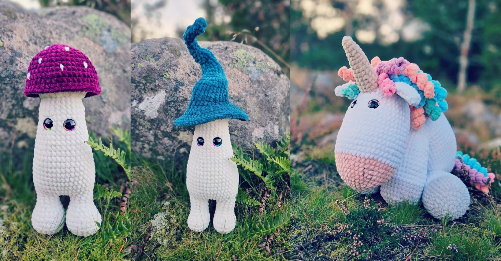

# VirkadeVäsen - Handcrafted Crocheted Animals



An elegant e-commerce platform for handcrafted crocheted animals, built with modern web technologies.

## Features

- **User Authentication** - Secure login and registration via Supabase Auth
- **Product Browsing** - Browse products by category, color, or latest additions
- **Shopping Cart** - Add products to cart, adjust quantities, and checkout
- **Payment Processing** - Secure payments through Stripe integration
- **Responsive Design** - Seamless experience on all devices

## Tech Stack

### Frontend

- **Next.js 15** - React framework with server and client components
- **TypeScript** - Type-safe code
- **Tailwind CSS** - Utility-first styling
- **Shadcn/UI** - Component library for rapid UI development
- **Zustand** - State management

### Backend

- **Next.js API Routes** - Serverless API endpoints
- **Server Actions** - Modern data mutation approach
- **Supabase** - Database, authentication, and storage
- **Stripe** - Payment processing
- **Zod** - Runtime schema validation

## Getting Started

### Prerequisites

- Node.js 18+
- npm or yarn
- Supabase account
- Stripe account (for payment processing)

### Environment Setup

Create a `.env.local` file with the following variables:

```env
NEXT_PUBLIC_SUPABASE_URL=your_supabase_url
NEXT_PUBLIC_SUPABASE_ANON_KEY=your_supabase_anon_key
STRIPE_SECRET_KEY=your_stripe_secret_key
NEXT_PUBLIC_STRIPE_PUBLISHABLE_KEY=your_stripe_publishable_key
NEXT_PUBLIC_APP_URL=your_vercel_url
```

### Installation

```bash
# Clone the repository
git clone https://github.com/pjkbsn/VirkadeVasen.git

# Navigate to project directory
cd VirkadeVasen

# Install dependencies
npm install

# Start development server
npm run dev
```

Open [http://localhost:3000](http://localhost:3000) to see the application.

### Database Setup

1. Create a Supabase project
2. Run the database schema in `schema.sql`
3. Set up Row Level Security (RLS) policies as needed

## Project Structure

### 🔐 Authentication

The application uses Supabase Authentication with email/password login. Role-based access controls protect admin functionality.

### 💳 Payment Processing

Payments are processed via Stripe Checkout with seamless integration:

- Secure checkout redirection
- Payment confirmation

### 🚀 Deployment

The site is deployed on Vercel for optimal Next.js performance. Key deployment optimizations include:

- ESLint error fixes for successful builds
- Properly typed error handling with 'unknown' type
- Fixed conditional React hook usage
- Next.js 15 async param handling
- Browser cache busting for favicon
- Correct Stripe integration in checkout flow

### 📱 Responsive Design

The application is fully responsive with layouts optimized for:

- Mobile devices
- Tablets
- Desktop computers

## Contributors

- Philip Jakobsson

## License

This project is licensed under the MIT License - see the LICENSE file for details.
